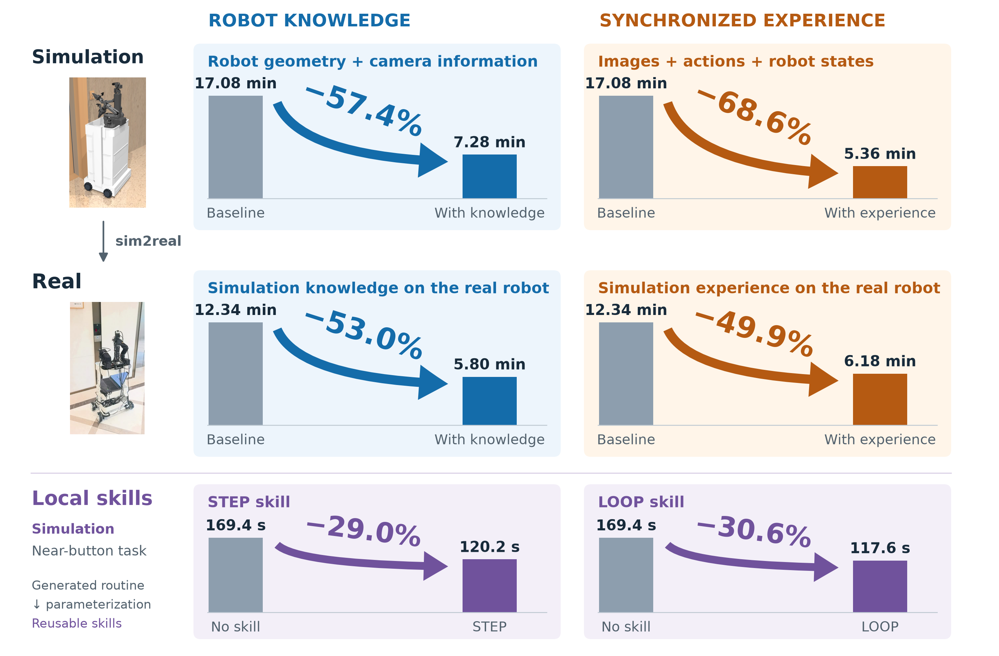
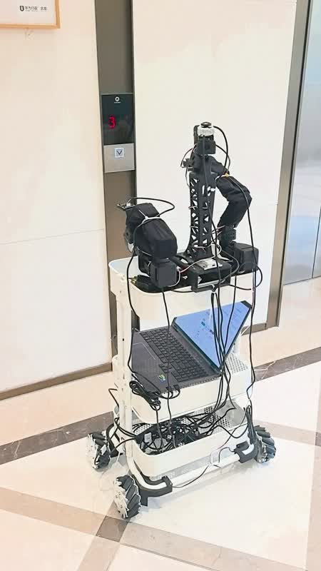

# Robot Manipulation with GPT-6-Astra

**Body knowledge, experience reuse, emergent skills, and sim2real transfer.**

Robot geometry and recorded experience make elevator-button manipulation controlled by GPT-6-Astra faster in simulation and on a physical XLeRobot. Reusable local skills further accelerate the final approach in simulation. GPT-6-Astra reads the supplied materials, observes current camera images, and writes programs against a low-level control API, with model weights held fixed.

All task prompts, trial-level experimental data, and acquired skill implementations are included in this repository. See the [materials index](experiments/README.md).

[Paper](paper/main.pdf) · [Results and behavior](report/REPORT.md) · [Experimental methods](docs/METHODS.md) · [Reproduction guide](docs/REPRODUCING.md)



## Main findings

| Evaluation | Design | Result |
|---|---|---|
| Body knowledge | 30 fixed-start simulation trials across ten information/experience conditions | Complete robot geometry and camera information reduce mean time by **57.4%** relative to the baseline with no extra assets or experience |
| Synchronized experience | Same fixed-start study | Images with synchronized actions and states reduce mean time by **68.6%**, using the same baseline |
| New starting positions | 18 trials at nine paired points, 10–100 cm from the original start | Experience recorded at the original start reduces mean time by **58–63%** across the offset groups and is faster at every point |
| Reusable local skills | 27 near-button simulation trials | STEP and LOOP reduce mean time by **29.0%** and **30.6%** relative to the condition with no supplied skill |
| Sim2real and real-experience reuse | 12 real-robot trials | Simulation assets and simulation experience reduce same-start mean time by **53.0%** and **49.9%**; real experience also supports successful execution from two new starts |

STEP executes one short movement and returns an image to Astra. LOOP repeats movements and image checks internally until it detects the simulated button's activation signal or reaches an execution limit. Both are derived from a feedback routine Astra generated during task execution.

Simulation success requires button activation; real-robot success uses operator-confirmed gripper-tip contact. Task time includes observation, model interaction, action execution, and outcome confirmation. The [methods](docs/METHODS.md) describe the task and timing protocols.

The sim2real results connect these gains to observable behavior: Astra parses simulation geometry into kinematics calculations, reuses working arm configurations and historical visual references, and adjusts the arm and base using fresh images in the real lobby.

## Real-robot demonstration

<a href="media/D3-6x-muted.mp4"></a>

- [D3 at 6× speed, silent, approximately 56 seconds](media/D3-6x-muted.mp4)
- [D3 at original speed, silent, approximately 5 minutes 36 seconds](media/D3-realtime-muted.mp4)

This demonstration shows real experience reused from a new starting position. Both versions preserve the full supplied recording and have no audio. The experiment's recorded task time is 360.0 s. Videos are stored with Git LFS; encoding and timing details are in the [media guide](media/README.md).

## Read the work

- [Paper PDF](paper/main.pdf) and [LaTeX source](paper/main.tex)
- [Detailed report](report/REPORT.md)
- [Methods and metric definitions](docs/METHODS.md)
- [Supplementary comparisons](report/SUPPLEMENTARY.md)
- [Reproduce figures and offline checks](docs/REPRODUCING.md)
- [Real-robot calibration and operation](docs/REAL_ROBOT.md)
- [Artifact and source index](experiments/README.md)

## Reproduce the analysis

```bash
python3 -m venv .venv
. .venv/bin/activate
python -m pip install -r analysis/requirements.txt
python analysis/build_results.py
python analysis/check_release.py
```

`analysis/build_results.py` regenerates summary statistics, manuscript tables, and figures from the released per-trial JSON files. These commands run offline. See the [reproduction guide](docs/REPRODUCING.md) for simulation checks and manuscript compilation.

## Repository layout

```text
paper/         English manuscript, bibliography, figures, build scripts
report/        Main report and exploratory supplementary results
results/       Per-trial metrics and real public motion-request records
analysis/      Deterministic aggregation, plots, and release checks
sim/           Simulation runtime, robot/scene assets, frozen study materials
real/          Hardware-control, calibration, and experiment-panel source
experiments/   Input provenance, real materials, spontaneous program example
media/         Silent real-time and 6× D3 videos; illustrative frames
docs/         Methods, installation, operation, and portability notes
```

Earlier simulation studies of written-experience iteration, target information, and experience compression are described in the [supplementary comparisons](report/SUPPLEMENTARY.md).

## Authors and attribution

Sida He, Lingxi Xie, Yunning Cao, Pengfei Chen, Kaiwen Duan, Jiannan Ge, Xinyue Huo, Jiacheng Shao, and Qi Tian (corresponding author), Huawei Inc., China.

The repository accompanies the reviewed English manuscript. Upstream attribution and licensing information are in [THIRD_PARTY.md](docs/THIRD_PARTY.md).
