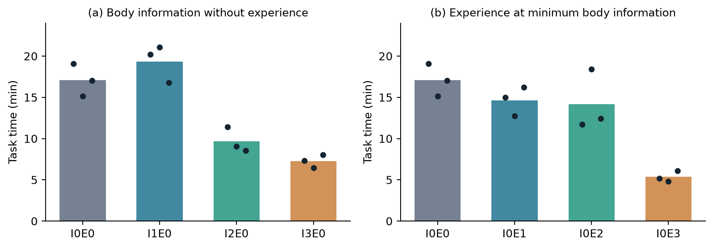
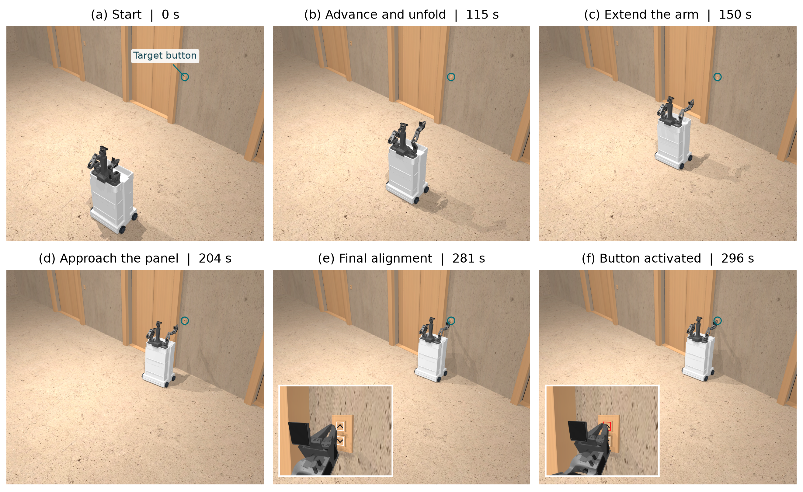
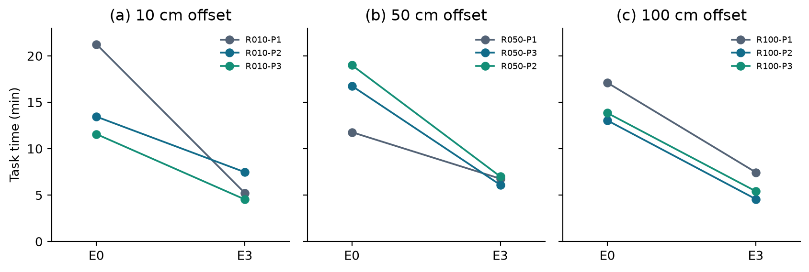
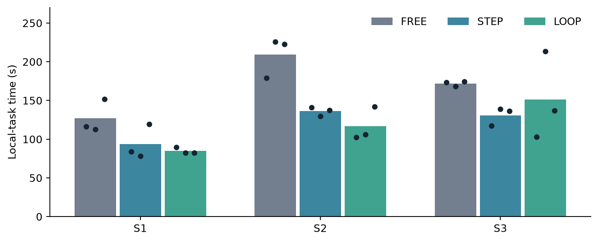
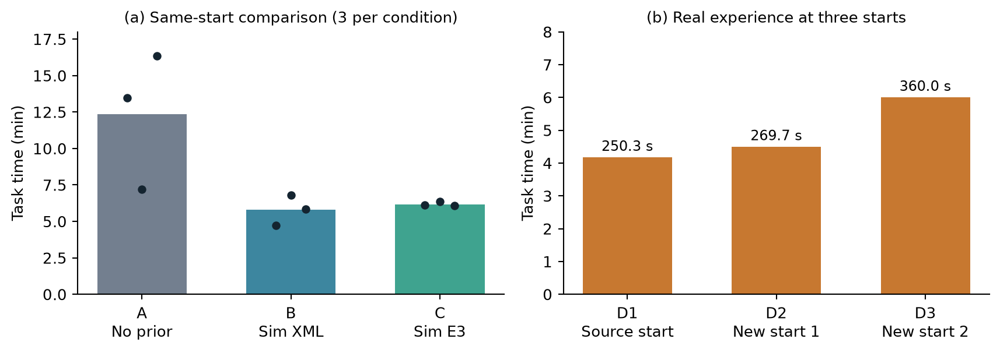

# Knowledge, experience, skills, and sim2real: experimental report

The core result is that explicit geometry and synchronized successful experience reduce repeated work in elevator-button manipulation controlled by GPT-6-Astra. The evidence extends from fixed simulation starts, through displaced starts and local program reuse, to a real elevator lobby. Model weights are unchanged.

## 1. Fixed-start simulation

Thirty trials compare ten conditions with three repetitions each. Complete geometry and camera references reduce no-experience mean time from 1024.9 to 437.1 s (57.4%). Mechanical geometry without camera information reaches 579.8 s (43.4%). Qualitative structure alone reaches 1160.4 s, so more information is not automatically more useful.

Without extra body assets (I0), experience containing images and synchronized action/state records (E3) reduces the mean from 1024.9 to 321.4 s (68.6%). With complete geometry and camera information (I3), it reduces 437.1 to 288.9 s (33.9%). All three E3 trials are faster than all three corresponding no-experience (E0) trials in both comparisons. The [methods](../docs/METHODS.md) define the information levels, and [fixed-start.json](../results/fixed-start.json) contains every trial.

The logs show XML parsing, forward kinematics and mesh inspection in geometric conditions. Six I0E3/I3E3 trials reuse the source right-arm target combination `(1.0, 1.2, -0.84)` rad for joints 2–4. All six deploy the arm in two stages with a fresh observation between them; five also issue six base commands between the stages. In the first I0E3 trial, after deploying the arm and approaching the panel, Astra reopens historical head and right-wrist images, then continues with short advances and lateral corrections. Near contact, it separately observes shorter movements and continues past apparent image overlap until activation is visible. This is evidence of experience use during execution as well as initial pose selection. Actions alone do not explain all time differences: I3E3 has more motion requests than I3E0 on average but is faster.

The first I0E3 trial progresses from its start through arm deployment and approach to visible button activation. The six frames use recorded states at 0, 115, 150, 204, 281, and 296 s; the task finishes at 310.042 s. Insets compare the last alignment with the activated red indicator.

## 2. New simulation starts

Experience recorded at the original start is evaluated at nine new points, each paired with a no-experience trial. Offset radii are 10, 50 and 100 cm, with three directions at each radius; initial heading and arm pose stay fixed. E3 is faster in all nine pairs, reducing mean time by 58–63% across the three offset groups. Mean times are approximately 15:25 versus 5:44, 15:50 versus 6:37, and 14:39 versus 5:48, respectively. This demonstrates generalization of the source experience to the tested new starting positions.

All nine displaced-start E3 trials also use two arm-deployment stages with fresh feedback between them. Across all 15 fixed/displaced E3 trials, 11 have six to ten base commands between the stages. After deployment, these simulation trials retain the working arm targets and adjust the base. Joint requests decrease by 81.5%, versus 12.0% for base requests at displaced starts. The largest reduction in motion requests comes from avoiding repeated arm search, within an approach that also uses historical visual references and current observations. [Behavior evidence](../results/behavior-evidence.json) and its [offline audit](../analysis/audit_behavior.py) support these counts and the mid-execution image example.

## 3. Emergent local program and skill evaluation

During a supplementary trial, Astra writes a local routine combining short advances, new images, and a red-pixel success check. It executes four steps in about 4.6 s. Using 15–25 s inter-call intervals observed in later records, avoiding three intermediate model round trips gives an estimated 45–75 s reduction in decision latency for this four-step scenario. Total task time also includes initial observation, program construction, and final confirmation. The skill evaluation measures end-to-end performance when these routines are available for reuse.

Researchers refactor that behavior into STEP and LOOP skills. FREE has no supplied skill but may write allowed control programs. STEP executes one bounded pulse and returns feedback; LOOP repeats pulses and checks a red-pixel stopping threshold after each pulse. Astra selects movement direction, speed, and duration for both routines, plus the image region and execution budget for LOOP. Twenty-seven tests use three near-button states, each with three repeats per condition.

FREE, STEP and LOOP average 169.4, 120.2 and 117.6 s. STEP reduces the mean by 29.0% and is faster than FREE in 9/9 matched comparisons; LOOP reduces it by 30.6% and is faster in 8/9. Most of the improvement is already achieved by STEP. LOOP's overall mean is 2.2% lower than STEP's, with faster times in 4/9 comparisons.

At S3, LOOP averages 151.1 s versus STEP's 130.8 s, mainly because one 213.3 s trial needs seven calls to revise direction and alignment. LOOP checks when to stop but fixes direction within a call, so these repeated returns to Astra offset its round-trip savings; the [behavior audit](../results/behavior-evidence.json) retains the detailed timings.

## 4. Sim2real

Twelve real-robot trials evaluate transfer to a different lobby and the DOWN call button opposite the initial robot position. The executed success criterion is operator-confirmed gripper-tip contact because the physical button is stiff. The [methods](../docs/METHODS.md) describe the protocol and its relationship to the archived task prompt.

| Condition | Repeat 1 | Repeat 2 | Repeat 3 | Mean |
|---|---:|---:|---:|---:|
| A: no assets/experience | 808.9 s | 431.5 s | 980.1 s | 740.1 s |
| B: simulation XML | 284.3 s | 408.5 s | 351.2 s | 348.0 s |
| C: simulation E3 | 366.5 s | 381.3 s | 364.3 s | 370.7 s |
| D: real E3 | 250.3 s | 269.7 s | 360.0 s | 293.4 sa |

a D's mean summarizes three placements: D1 shares the A/B/C start; D2 and D3 use two new starts.

A/B/C share a nominal start. Simulation assets and simulation experience reduce mean time by 53.0% and 49.9%; each B/C result is faster than the fastest A. All B trials parse the supplied geometry and perform kinematics calculations; the latter two also inspect meshes. B's average arm/head requests decrease from 20.0 to 3.7, and base requests from 18.7 to 10.7.

All C trials read source action records and view historical simulation images: one head image each for C1/C2 and three for C3. In C2, Astra adopts the simulated right-arm targets `(1.0, 1.2, -0.84)` rad at about 104 s, then changes them to `(1.65, 1.2, -0.19)` rad at about 143 s as it adjusts its approach from current images. The first two trials also move left initially and subsequently correct to the right, consistent with a source-related directional preference that requires correction in the new lobby. These observations show both useful reuse and unhelpful carryover, followed by online adjustment. All three complete the current DOWN-button task using experience from the simulated UP-button task.

D uses ordinary E3 extracted from the fastest A trial. D1 shares the source start and finishes in 250.3 s; D2/D3 use two different new starts and finish in 269.7/360.0 s. In D2, Astra reuses the source arm target `(2.07, 1.9, -0.11)` rad; D1 reaches it later, while D3 uses a different configuration and continues adjusting. Real experience thus also supports execution beyond its source starting position.

The [silent D3 video](../media/D3-realtime-muted.mp4) and [6× version](../media/D3-6x-muted.mp4) provide an external demonstration. The supplied recording spans 336.27 s; the task event log records a 360.036 s completion interval.

## 5. Interpretation

The sim2real results suggest that three observed capabilities work together: Astra converts explicit body descriptions into geometric programs, extracts configurations and approach references from images and action histories, and revises commands using current feedback. Its software connection to the robot does not automatically provide the custom body's link geometry or camera mounting; these must be supplied or inferred. Shared calibrated joint conventions preserve the meaning of body information, while live images guide alignment in the new lobby. Geometric calculations in B and arm-target revisions in C show how supplied simulation materials support decisions adapted to the physical scene.

The simulation findings identify useful units of reuse: a working configuration reached through staged deployment, historical visual references consulted during execution, and approach actions adjusted using current images. Local skills illustrate how bounded execution can be reused while Astra chooses and revises view-dependent parameters. The S3 result shows why a stop condition alone cannot replace alignment feedback. A routine that estimates progress, adjusts direction, or returns early when alignment is lost is a concrete next experiment.

## 6. Limitations

The study covers one robot platform and task family, with three repetitions per main condition and one selected source per domain. Experience can carry over inefficient choices, as in the left-then-right corrections of two real trials. Pose-only and preset-pose controls would separate the value of the working pose from richer experience. The two new real starts lack matched baselines, and hardware success uses operator-confirmed contact rather than verified depression. Broader tests across sources, headings, and embodiments, and local alignment feedback for LOOP, would extend these findings.

See the [supplementary comparisons](SUPPLEMENTARY.md), [methods](../docs/METHODS.md), and [paper](../paper/main.pdf) for the exploratory studies, definitions, and full analysis.
